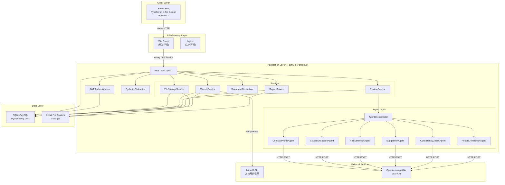
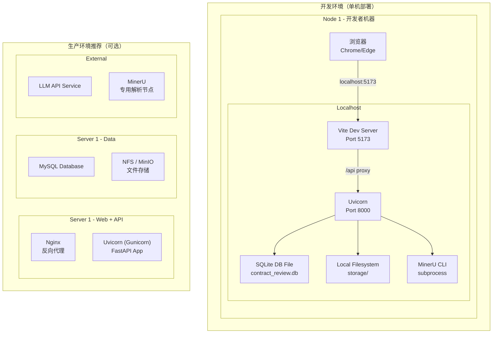
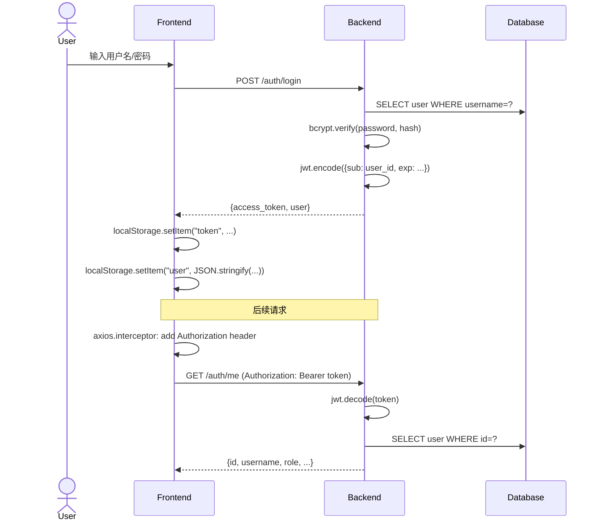
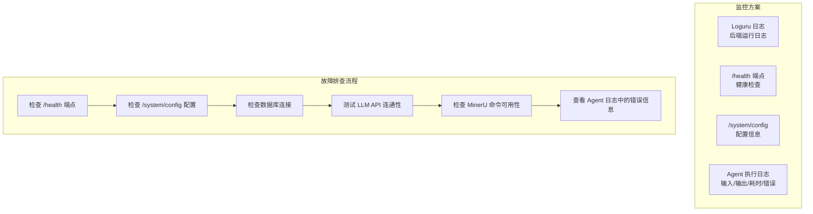
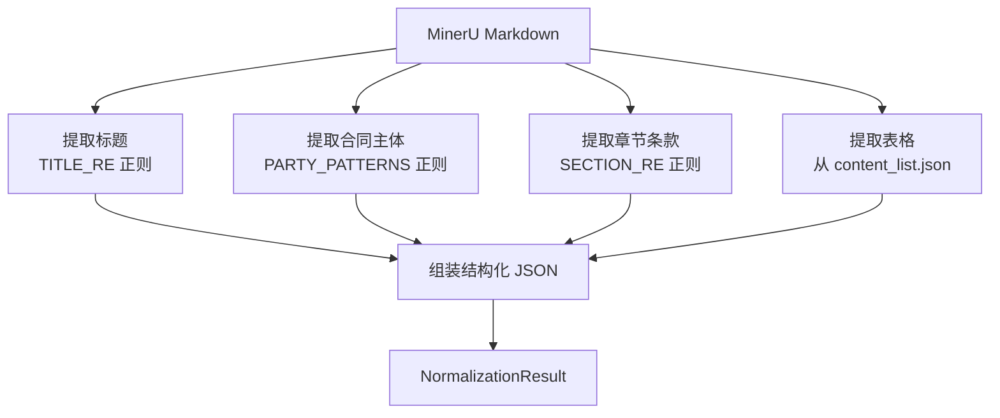

# ClauseMind 合同智能审查系统 —— 系统设计文档

## 1. 技术选型

### 1.1 技术选型分析

| 技术需求 | 可选方案 | 选择理由 |
|---------|---------|---------|
| 后端框架 | FastAPI / Spring Boot / Django | **FastAPI**：原生异步支持、Pydantic 数据校验、自动生成 OpenAPI 文档、Python 生态方便集成 AI 服务 |
| 前端框架 | React / Vue / Angular | **React 18 + Vite**：组件化开发、TypeScript 支持完善、Ant Design 生态成熟、构建速度快 |
| 数据库 | SQLite / MySQL / PostgreSQL | **SQLite（开发）+ MySQL（生产）**：开发便捷、可通过 SQLAlchemy 无缝切换 |
| ORM | SQLAlchemy / Django ORM / Prisma | **SQLAlchemy 2.x**：异步支持、声明式映射、Alembic 迁移管理 |
| AI 集成 | 直接调用 / LangChain / 多 Agent | **直接调用 + 多 Agent**：简洁可控、6 个专用 Agent 可独立调试和演进 |
| 文档解析 | MinerU / PyMuPDF / Tika | **MinerU**：支持 PDF/DOCX/图片、输出 Markdown+JSON 结构化结果 |
| 认证 | JWT / Session / OAuth2 | **JWT + OAuth2PasswordBearer**：无状态、前后端分离友好 |
| UI 组件 | Ant Design / Element Plus / Material UI | **Ant Design 5**：企业级后台风格、React 生态首选 |
| 状态管理 | Zustand / Redux / MobX | **Zustand**：轻量、TypeScript 友好、API 简洁 |
| 图表 | ECharts / Recharts / Chart.js | **ECharts**：功能丰富、中文文档完善 |

### 1.2 为什么选择 FastAPI 而非 Spring Boot？

| 对比维度 | FastAPI | Spring Boot |
|---------|---------|-------------|
| 语言生态 | Python — AI/ML 生态丰富，可直接调用 LLM | Java — 生态成熟但 AI 集成需额外适配 |
| 开发效率 | 代码量少、热重载、自动校验 | 配置繁琐、编译周期长 |
| 异步支持 | 原生 async/await | 需要 WebFlux 等额外配置 |
| 文档生成 | 自动 OpenAPI + Swagger UI | 需 Springfox 等插件 |
| 项目规模 | 适合中小型系统（课程设计规模） | 适合大型企业级系统 |

**核心结论**：本项目是课程设计项目，FastAPI 的单语言栈（Python 全栈）比 Java/Python 混合栈能节省 50% 以上的开发工作量，同时保持了良好的系统架构和工程完整性。

---

## 2. 系统架构设计方案

### 2.1 系统总体架构



### 2.2 微服务边界界定

本项目采用**单体架构 + 模块化设计**，原因如下：

- 课程设计阶段无需分布式系统复杂度
- FastAPI 模块化设计已足够清晰分离关注点
- 未来可按需拆分为独立微服务

**模块边界：**

| 模块 | 职责 | 边界 | 与其他模块的交互 |
|------|------|------|----------------|
| `core` | 基础配置、数据库、安全、响应格式 | 不包含业务逻辑 | 被所有模块依赖 |
| `models` | 数据库表定义（SQLAlchemy ORM） | 仅定义数据结构 | 被 API 和 Services 使用 |
| `schemas` | 请求/响应数据校验（Pydantic） | 仅定义数据契约 | 被 API 路由使用 |
| `agents` | LLM 调用和 Agent 逻辑 | 不涉及 HTTP 路由 | 被 ReviewService 调用 |
| `services` | 核心业务逻辑编排 | 不涉及 HTTP 处理 | 被 API 路由调用 |
| `api/v1` | HTTP 路由定义 | 不包含业务逻辑 | 调用 Services |

### 2.3 组件图

```mermaid
graph TB
    subgraph "FastAPI Application Components"
        direction TB
        
        component_core["core<br/>Config, DB, Security"]
        component_models["models<br/>SQLAlchemy Models"]
        component_schemas["schemas<br/>Pydantic Schemas"]
        component_services["services<br/>Business Logic"]
        component_agents["agents<br/>LLM Multi-Agent"]
        component_api["api/v1<br/>REST Endpoints"]
        component_prompts["prompts<br/>Agent Prompt Templates"]
        component_utils["utils<br/>Utility Functions"]
    end

    component_api --> component_services : calls
    component_api --> component_schemas : validates
    component_api --> component_core : auth+db
    component_services --> component_models : persists
    component_services --> component_agents : orchestrates
    component_services --> component_core : db
    component_agents --> component_prompts : loads
    component_agents --> component_core : config
    component_models --> component_core : base
    component_schemas --> component_core : base
```

### 2.4 部署图



### 2.5 认证与鉴权方案

**认证流程：**



**权限矩阵：**

| 接口 | 无需认证 | USER | admin |
|------|---------|------|-------|
| POST /auth/register | ✅ | - | - |
| POST /auth/login | ✅ | - | - |
| GET /auth/me | - | ✅ | ✅ |
| POST /contracts/upload | - | ✅ | - |
| GET /contracts | - | ✅（仅自己的） | - |
| GET /contracts/{id} | - | ✅（仅自己的） | - |
| DELETE /contracts/{id} | - | ✅（仅自己的） | - |
| POST /contracts/{id}/parse | - | ✅（仅自己的） | - |
| POST /contracts/{id}/review | - | ✅（仅自己的） | - |
| GET /admin/users | - | - | ✅ |
| GET /admin/statistics | - | - | ✅ |
| GET /health | ✅ | - | - |
| GET /system/config | ✅ | - | - |

**数据隔离策略：**
- 所有业务表包含 `user_id` 外键
- 普通用户查询自动添加 `WHERE user_id = current_user.id`
- 管理员可通过 `/api/v1/admin/*` 查看所有数据

### 2.6 安全性设计

| 安全需求 | 实现方式 |
|---------|---------|
| 密码存储 | bcrypt 哈希（12 轮 Salt） |
| 认证令牌 | JWT（HS256，24 小时有效期） |
| 传输安全 | 生产环境通过 Nginx 配置 HTTPS |
| 数据隔离 | SQL 查询自动过滤 user_id |
| 管理员权限 | 独立 role 校验中间件 |
| 文件上传 | 类型白名单 + UUID 重命名 |
| 路径安全 | 不暴露服务器内部路径 |

### 2.7 监控与日志



---

## 3. 关键技术点详解

### 3.1 多 Agent 协作框架

**架构设计：**

```
BaseAgent (抽象基类)
├── load_prompt() → 加载提示词模板
├── build_prompt(input) → 将输入数据填入模板
├── _call_llm(prompt) → 调用 LLM API
├── parse_json(raw_output) → 解析 JSON（含重试机制）
└── run(input) → 执行入口（含 JSON 解析失败重试）
    ├── 首次：尝试解析
    ├── 失败：追加重试指令
    └── 重试：再次解析或抛出 AgentError

6 个 Agent 继承 BaseAgent：
├── ContractProfileAgent — 提取合同画像
├── ClauseExtractionAgent — 抽取关键条款
├── RiskDetectionAgent — 识别风险项
├── SuggestionAgent — 生成修改建议
├── ConsistencyCheckAgent — 校验一致性
└── ReportGenerationAgent — 生成审查报告
```

**JSON 解析策略（`parse_json` 方法）：**

1. 尝试直接 `json.loads()`
2. 提取 Markdown 代码块中 ````json ... ```` 的内容
3. 从文本中提取第一个 `{...}` 对象
4. 若所有方法失败，追加重试指令重新调用 LLM

**Agent 执行顺序与依赖：**

```mermaid
graph LR
    A[ContractProfileAgent<br/>合同画像] --> B[ClauseExtractionAgent<br/>条款抽取]
    B --> C[RiskDetectionAgent<br/>风险识别]
    C --> D[SuggestionAgent<br/>修改建议]
    D --> E[ConsistencyCheckAgent<br/>一致性校验]
    E --> F[ReportGenerationAgent<br/>报告生成]
    
    A -.->|输出: contract_type, party_a, party_b, ...| B
    B -.->|输出: clauses[]| C
    C -.->|输出: risks[], overall_risk| D
    D -.->|输出: suggestions[]| E
    E -.->|输出: passed, issues[]| F
    F -.->|输出: markdown_report| 最终报告
```

### 3.2 MinerU 文档解析集成

**调用方式：** 通过 `subprocess.run()` 调用 MinerU CLI

```python
# MinerUService.parse() 核心逻辑
command = [
    "mineru",
    "-p", input_path,      # 输入文件
    "-o", output_dir,       # 输出目录
    "-b", backend,          # 后端（hybrid-auto-engine）
]
result = subprocess.run(command, capture_output=True, text=True, timeout=600)
```

**MinerU 输出收集：**
```
output_dir/
├── *.md              → Markdown 文本
├── content_list.json  → 结构化内容列表
├── *middle.json       → 中间处理数据
├── *layout*.pdf       → 布局分析 PDF
└── images/            → 提取的图片
```

**错误处理：**
1. MinerU CLI 不可用 → 友好提示配置
2. 执行超时（600 秒）→ 建议增大超时或检查文件
3. 返回值非零 → 返回 stderr 到前端
4. 未生成 Markdown → 提示解析不完整

### 3.3 文档标准化（DocumentNormalizer）

**输入：** MinerU 输出的原始 Markdown 文本 + content_list.json

**处理流程：**



**章节识别模式（`SECTION_RE`）：**
- `第[一二三四五六七八九十百千0-9]+条` — 中文编号条款
- `[一二三四五六七八九十]+、` — 中文编号标题
- `[0-9]+[.、]` — 数字编号标题
- `[0-9]+\.[0-9]+` — 多级数字标题
- `（[一二三四五六七八九十]+）` — 括号中文编号

### 3.4 LLM 客户端设计

```python
class LLMClient:
    """OpenAI-compatible Chat Completions 客户端"""
    
    def __init__(self, api_base, api_key, model, timeout):
        self.api_base = api_base.rstrip("/")
        self.api_key = api_key
        self.model = model
        self.timeout = timeout
    
    @property
    def chat_completions_url(self):
        """标准化 Chat Completions 端点 URL"""
        # 处理多种 base URL 格式
        # - https://api.example.com/
        # - https://api.example.com/v1
        # - https://api.example.com/v1/chat/completions
    
    async def chat(self, prompt, system_prompt=None) -> str:
        messages = []
        if system_prompt:
            messages.append({"role": "system", "content": system_prompt})
        messages.append({"role": "user", "content": prompt})
        
        # 调用 OpenAI-compatible Chat Completions API
        async with httpx.AsyncClient(timeout=self.timeout) as client:
            response = await client.post(url, headers=headers, json=payload)
            response.raise_for_status()
            data = response.json()
        
        return data["choices"][0]["message"]["content"]
```

**重试机制：** 不在客户端层重试 LLM 调用，而是由 `BaseAgent` 在 JSON 解析失败时进行重试。

### 3.5 报告生成与导出

**报告结构（Markdown 格式）：**
```markdown
# 合同智能审查报告

**综合风险等级：** 中风险

---

## 一、合同基本信息
- 合同类型：房屋租赁合同
- 甲方：张三
- 乙方：李四
- ...

## 二、风险分析
| 风险ID | 风险等级 | 风险类型 | 描述 |
|--------|---------|---------|------|
| R1 | 高风险 | 违约责任模糊 | ... |

## 三、修改建议
...

## 四、一致性校验
...

---

*免责声明：本报告由 AI 系统自动生成...*
```

**导出支持：**
- Markdown 格式下载（`/reports/{id}/export`）
- HTML 格式下载（`/reports/{id}/export/html`）

---

## 4. 系统附注说明

### 4.1 运行与开发环境

| 项目 | 版本/说明 |
|------|----------|
| 操作系统 | Linux（开发）/ macOS / Windows（WSL2） |
| Python | ≥ 3.11 |
| Node.js | ≥ 18 |
| 包管理 | uv（Python）/ npm（Node.js） |
| 数据库 | SQLite 3.x（开发）/ MySQL 8.x（生产） |
| 文档解析 | MinerU CLI |
| LLM | OpenAI-compatible API（Ollama/Qwen/GPT/Claude ...） |

### 4.2 安装与运行方法

**后端启动：**
```bash
cd backend
uv sync                          # 安装依赖
cp .env.example .env             # 配置环境变量
uv run alembic upgrade head       # 数据库迁移
uv run uvicorn main:app --reload  # 启动服务
```

**前端启动：**
```bash
cd frontend
npm install                      # 安装依赖
npm run dev                      # 启动开发服务器
```

**演示数据生成：**
```bash
cd backend
uv run python scripts/seed_demo.py
```

**演示账号：**

| 角色 | 用户名 | 密码 |
|------|--------|------|
| 管理员 | admin | admin123456 |
| 普通用户 | demo | demo123456 |

### 4.3 系统规模

| 模块 | 语言 | 代码量 |
|------|------|--------|
| 后端 API 路由 | Python | ~1,200 行 |
| 后端模型/模式 | Python | ~400 行 |
| 后端服务层 | Python | ~800 行 |
| 后端 Agent 层 | Python | ~500 行 |
| 后端测试 | Python | ~1,600 行 |
| 后端其他（配置/工具） | Python | ~400 行 |
| **后端合计** | **Python** | **~4,900 行** |
| 前端页面 | TypeScript/TSX | ~1,200 行 |
| 前端组件/API/Store | TypeScript | ~600 行 |
| 前端配置/路由 | TypeScript | ~100 行 |
| **前端合计** | **TypeScript** | **~1,900 行** |
| Agent 提示词 | 文本 | ~130 行 |
| SQL 脚本 | SQL | ~5 行 |
| **系统总计** | **-** | **~6,935 行** |
