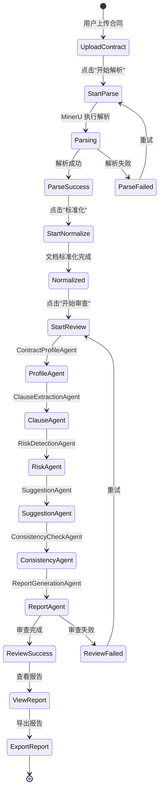
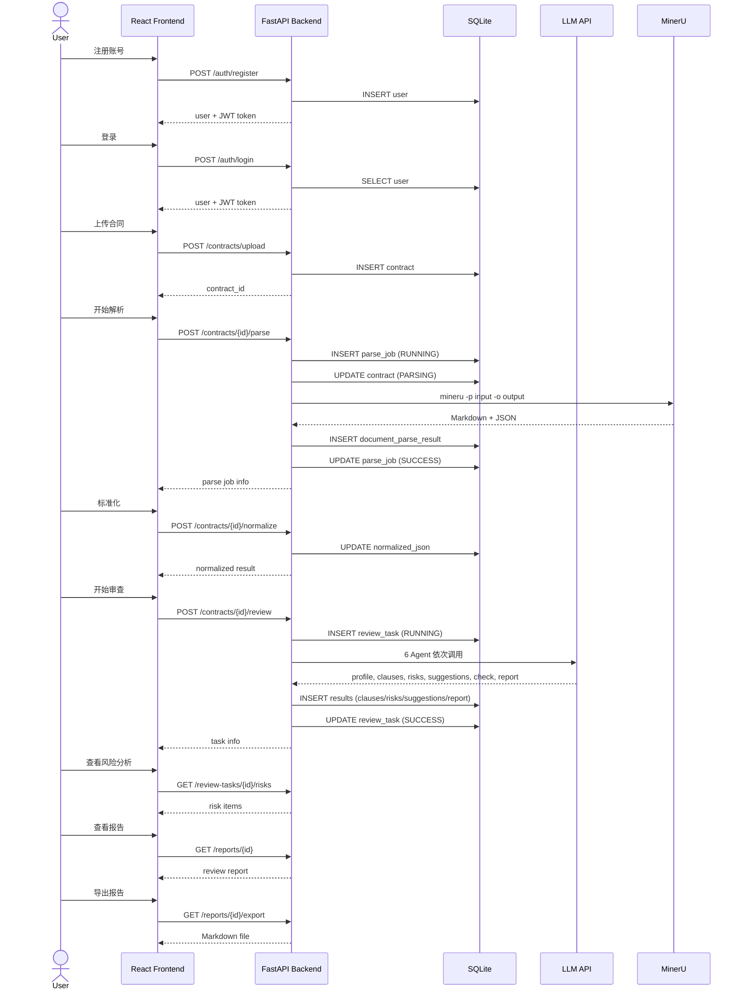
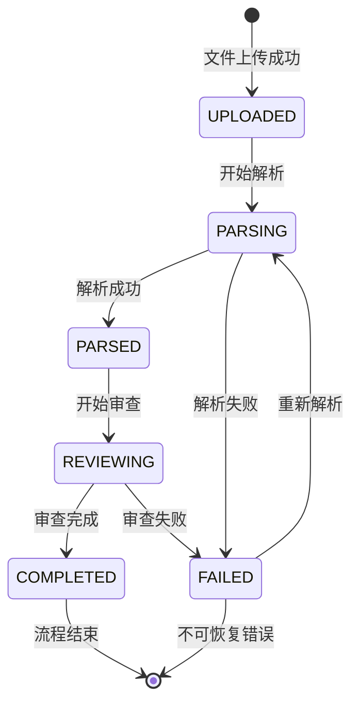
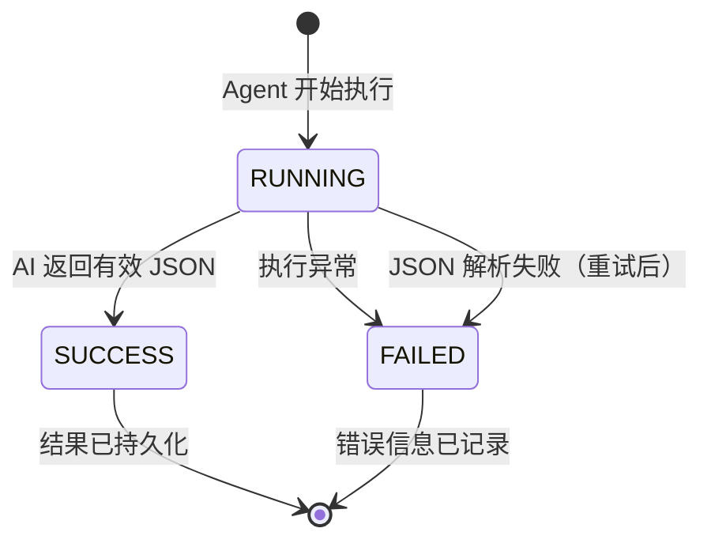

# ClauseMind 合同智能审查系统 —— 系统需求文档

## 1. 项目可行性分析与描述

### 1.1 领域定位

ClauseMind 属于**智能文档处理与法律科技（LegalTech）**领域。系统聚焦于**合同文本的辅助审查**，为用户提供合同上传、文档解析、结构化提取、风险识别、修改建议和审查报告生成等一站式服务。

**领域边界划定：**
- 核心边界：合同文本的智能解析与审查，不涉及合同签署、合同管理全生命周期
- 技术边界：基于 LLM 的多 Agent 协作系统，非传统规则引擎
- 输出边界：仅提供风险提示和修改建议，不替代专业律师的法律意见

### 1.2 用户需求分析

| 用户类型 | 需求描述 | 解决的问题 |
|---------|---------|-----------|
| 个人用户 | 快速理解合同内容、识别潜在风险 | 普通人难以逐条审阅合同中的法律条款和潜在陷阱 |
| 小微企业 | 高效审阅日常合同（租赁、采购、劳务等） | 小微企业无力聘请专职法务，需要低成本审查方案 |
| 自由职业者 | 审查合作合同，保护自身权益 | 快速发现不平等的权利义务条款 |
| 法律从业者 | 辅助初步审查，提高工作效率 | 减少重复性劳动，聚焦于高价值判断 |

### 1.3 竞品分析

| 竞品 | 优势 | 劣势 | 本系统对比 |
|------|------|------|-----------|
| **法天使** | 专业法律数据库，合同模板丰富 | 以模板为主，缺乏智能解析能力 | ClauseMind 提供 AI 驱动的主动审查，而非模板匹配 |
| **秘塔法律AI** | 法律问答能力强 | 不支持合同上传和结构化解析 | ClauseMind 结合 MinerU 文档解析与多 Agent 审查 |
| **GPT-4o 等通用LLM** | 通用对话能力强 | 缺乏专有文档解析能力，缺乏结构化输出 | ClauseMind 设计了 6 个专用 Agent 协同工作，流程更可控 |
| **传统合同审查系统** | 稳定可靠 | 依赖规则库，维护成本高 | 基于 LLM 动态分析，适应性强 |

**本系统核心优势：**
1. 端到端流程：上传→解析→审查→报告，一站式完成
2. 多 Agent 协作：6 个专业 Agent 分工明确，审查全面
3. MinerU 文档解析支持：支持 PDF/DOCX/图片等多种格式
4. 开源透明：完整的工程实践，适合学习和二次开发

---

## 2. 系统功能分析

### 2.1 功能分解层次图

```
ClauseMind 合同智能审查系统
├── 一级：用户管理
│   ├── 二级：注册 (权重 9)
│   │   └── 三级：用户名密码注册
│   ├── 二级：登录 (权重 10)
│   │   └── 三级：JWT 身份认证
│   ├── 二级：用户信息管理 (权重 5)
│   │   └── 三级：查看当前用户信息
│   └── 二级：权限控制 (权重 8)
│       ├── 三级：普通用户权限（管理自有合同）
│       └── 三级：管理员权限（全局管理）
│
├── 一级：合同管理
│   ├── 二级：合同上传 (权重 10)
│   │   ├── 三级：文件格式校验（PDF/DOCX/TXT/图片）
│   │   └── 三级：文件大小限制（50MB）
│   ├── 二级：合同列表 (权重 8)
│   │   └── 三级：分页、状态标签展示
│   ├── 二级：合同详情 (权重 7)
│   │   └── 三级：基本信息展示
│   └── 二级：合同删除 (权重 6)
│       └── 三级：用户数据隔离删除
│
├── 一级：文档解析
│   ├── 二级：MinerU 调用 (权重 9)
│   │   ├── 三级：subprocess 调用 MinerU CLI
│   │   └── 三级：超时与错误处理
│   ├── 二级：解析状态跟踪 (权重 7)
│   │   └── 三级：WAITING→RUNNING→SUCCESS/FAILED
│   ├── 二级：Markdown 预览 (权重 6)
│   │   └── 三级：解析结果的 Markdown 渲染展示
│   └── 二级：文档标准化 (权重 8)
│       ├── 三级：标题提取
│       ├── 三级：合同主体（甲方/乙方）识别
│       ├── 三级：章节和条款结构化
│       └── 三级：表格提取
│
├── 一级：多 Agent 审查
│   ├── 二级：ContractProfileAgent — 合同画像 (权重 9)
│   │   └── 三级：提取合同类型、双方信息、金额、期限等
│   ├── 二级：ClauseExtractionAgent — 条款抽取 (权重 9)
│   │   └── 三级：抽取关键条款并分类
│   ├── 二级：RiskDetectionAgent — 风险识别 (权重 10)
│   │   └── 三级：识别风险项并分级（高/中/低）
│   ├── 二级：SuggestionAgent — 修改建议 (权重 8)
│   │   └── 三级：针对风险给出具体修改建议
│   ├── 二级：ConsistencyCheckAgent — 一致性校验 (权重 7)
│   │   └── 三级：校验各 Agent 输出的一致性
│   └── 二级：ReportGenerationAgent — 报告生成 (权重 9)
│       └── 三级：生成 Markdown 格式审查报告
│
├── 一级：审查结果展示
│   ├── 二级：Agent 执行日志 (权重 7)
│   │   └── 三级：展示输入、输出、状态、耗时、错误
│   ├── 二级：风险分析 (权重 9)
│   │   └── 三级：分级展示风险项及原因
│   ├── 二级：修改建议 (权重 8)
│   │   └── 三级：展示原文和建议修改文本
│   └── 二级：审查报告 (权重 9)
│       ├── 三级：Markdown 渲染展示
│       └── 三级：Markdown/HTML 报告导出
│
├── 一级：管理员后台
│   ├── 二级：用户管理 (权重 6)
│   ├── 二级：合同管理 (权重 6)
│   ├── 二级：审查任务管理 (权重 6)
│   ├── 二级：Agent 日志管理 (权重 5)
│   ├── 二级：系统统计 (权重 7)
│   │   └── 三级：用户数、合同数、风险统计
│   └── 二级：演示数据生成 (权重 5)
│
└── 一级：系统基础
    ├── 二级：健康检查 (权重 4)
    ├── 二级：CORS 跨域支持 (权重 5)
    └── 二级：统一响应格式 (权重 5)
```

### 2.2 用例图

```mermaid
graph TB
    subgraph "ClauseMind 系统"
        direction TB
        
        Register["注册账号"]
        Login["登录系统"]
        UploadContract["上传合同"]
        ViewContracts["查看合同列表"]
        ViewContract["查看合同详情"]
        DeleteContract["删除合同"]
        StartParse["启动 MinerU 解析"]
        ViewParseResult["查看解析结果"]
        NormalizeDoc["标准化文档"]
        StartReview["启动合同审查"]
        ViewReviewProgress["查看审查进度"]
        ViewRiskAnalysis["查看风险分析"]
        ViewSuggestion["查看修改建议"]
        ViewReport["查看审查报告"]
        ExportReport["导出审查报告"]
        ManageUsers["管理用户"]
        ManageContracts["管理合同"]
        ViewAgentLogs["查看 Agent 日志"]
        ViewStatistics["查看系统统计"]
    end

    User("普通用户") --- Register
    User --- Login
    User --- UploadContract
    User --- ViewContracts
    User --- ViewContract
    User --- DeleteContract
    User --- StartParse
    User --- ViewParseResult
    User --- NormalizeDoc
    User --- StartReview
    User --- ViewReviewProgress
    User --- ViewRiskAnalysis
    User --- ViewSuggestion
    User --- ViewReport
    User --- ExportReport

    Admin("管理员") --- ManageUsers
    Admin --- ManageContracts
    Admin --- ViewAgentLogs
    Admin --- ViewStatistics
    Admin --- Login
```



### 2.3 系统功能分配

| 功能模块 | 后端（FastAPI） | 前端（React） |
|---------|----------------|--------------|
| 用户注册/登录 | 注册/登录 API、JWT 签发 | 登录/注册页面、Token 存储 |
| 合同管理 | 上传/列表/详情/删除 API | 合同上传/列表/详情页面 |
| 文档解析 | MinerU 调用、状态跟踪 | 解析状态、Markdown 预览 |
| 文档标准化 | Normalizer 处理 | 标准化结果展示 |
| 多 Agent 审查 | 6 Agent 工作流编排 | 审查进度步骤条 |
| 审查结果 | 风险/建议/报告查询 API | 风险/建议/报告展示页 |
| 报告导出 | Markdown/HTML 生成 | 导出按钮 |
| 管理员后台 | 管理端 API（6 个接口） | 管理员表格页面 |
| 健康检查 | /health 端点 | 工作台状态面板 |
| 演示数据 | seed_demo.py 脚本 | - |

### 2.4 系统运行截图

> ⚠️ *注：以下为关键功能界面的描述，实际截图需在系统部署运行后补充。*

**截图 1：登录页面**
- 功能：用户登录入口
- 包含：用户名输入框、密码输入框、登录按钮、注册链接
- 交互逻辑：输入凭据后调用 `POST /api/v1/auth/login`

**截图 2：注册页面**
- 功能：新用户注册
- 包含：用户名输入框、邮箱输入框（可选）、密码输入框、注册按钮
- 交互逻辑：注册成功后自动登录并跳转至工作台

**截图 3：工作台**
- 功能：系统主入口，展示概览信息
- 包含：已上传合同数、已完成审查数、高风险合同数、后端联通状态
- 交互逻辑：从工作台可导航到所有功能模块

**截图 4：合同列表页**
- 功能：查看所有已上传的合同
- 包含：合同名称、合同类型、文件类型、文件大小、状态标签、操作（详情/解析/删除）
- 交互逻辑：支持启动解析、查看详情、删除操作

**截图 5：合同详情页**
- 功能：查看单个合同的详细信息
- 包含：合同 ID、状态、文件信息、上传时间、操作按钮（解析/审查）
- 交互逻辑：可跳转到解析结果、审查进度等页面

**截图 6：MinerU 解析结果页**
- 功能：展示文档解析状态和 Markdown 预览
- 包含：解析状态标签、原始 Markdown 渲染、标准化后的章节/条款/表格列表
- 交互逻辑：可执行文档标准化操作

**截图 7：审查进度页**
- 功能：展示 6 个 Agent 的执行进度
- 包含：Agent 步骤条（含状态标签）、合同画像信息、Agent 执行日志折叠面板
- 交互逻辑：点击日志可查看完整输入/输出

**截图 8：风险分析页**
- 功能：展示合同风险项
- 包含：风险 ID、风险等级（高/中/低标签）、风险类型、描述、原因、需人工复核标记
- 交互逻辑：风险项按危险等级排序

**截图 9：审查报告页**
- 功能：展示最终审查报告
- 包含：Markdown 渲染报告、综合风险等级、免责声明、导出按钮
- 交互逻辑：支持导出 Markdown 和 HTML 格式

**截图 10：管理员后台**
- 功能：系统全局管理
- 包含：系统统计卡片、用户/合同/任务/Agent 日志表格（支持筛选）
- 交互逻辑：管理员可查看所有用户和系统状态

### 2.5 开发计划

| 阶段 | 时间 | 任务 | 产出 |
|------|------|------|------|
| Phase 1 | 第 1 天 | 项目骨架搭建 | 前后端项目初始化、目录结构、配置 |
| Phase 2 | 第 2 天 | 用户与认证模块 | User 模型、注册/登录/鉴权 API |
| Phase 3 | 第 3 天 | 合同管理 | Contract 模型、上传/列表/详情/删除 |
| Phase 4 | 第 4 天 | MinerU 解析 | ParseJob、解析流程、状态跟踪 |
| Phase 5 | 第 4 天 | 文档标准化 | Normalizer、Markdown 结构化 |
| Phase 6 | 第 5 天 | 第一个 Agent | BaseAgent、ContractProfileAgent |
| Phase 7 | 第 6-7 天 | 多 Agent 工作流 | 6 个 Agent、编排、持久化 |
| Phase 8 | 第 8 天 | 结果展示页 | 风险/建议/报告页面 |
| Phase 9 | 第 9-10 天 | 管理后台与文档 | 管理员 API、课程设计文档 |

**功能依赖关系：**
- Phase 2 ← Phase 1（认证依赖基础架构）
- Phase 3 ← Phase 2（合同管理依赖用户系统）
- Phase 4 ← Phase 3（解析依赖合同上传）
- Phase 5 ← Phase 4（标准化依赖解析结果）
- Phase 6 ← Phase 5（Agent 依赖结构化文档）
- Phase 7 ← Phase 6（多 Agent 依赖单个 Agent）
- Phase 8 ← Phase 7（结果展示依赖审查完成）
- Phase 9 ← Phase 1~8（管理后台和文档依赖所有功能）

---

## 3. 领域模型

### 3.1 UML 类图

```mermaid
classDiagram
    class User {
        +int id
        +string username
        +string password_hash
        +string email
        +string role
        +string status
        +datetime created_at
        +datetime updated_at
        +register()
        +login()
    }

    class Contract {
        +int id
        +int user_id
        +string file_name
        +string stored_file_name
        +string file_path
        +string file_type
        +int file_size
        +string contract_type
        +string title
        +string status
        +datetime created_at
        +datetime updated_at
        +upload()
        +delete()
    }

    class ParseJob {
        +int id
        +int contract_id
        +string input_path
        +string output_dir
        +string backend
        +string status
        +string error_message
        +datetime started_at
        +datetime finished_at
        +datetime created_at
        +start()
        +finish()
    }

    class DocumentParseResult {
        +int id
        +int contract_id
        +int parse_job_id
        +string markdown_path
        +string content_json_path
        +string middle_json_path
        +string layout_pdf_path
        +string image_dir
        +text raw_markdown
        +text normalized_json
        +datetime created_at
    }

    class DocumentNormalizer {
        +normalize(markdown) NormalizationResult
        +extractTitle(text) string
        +extractParties(text) Party[]
        +extractSections(text) Section[]
    }

    class NormalizationResult {
        +string title
        +string contract_type
        +Party[] parties
        +Section[] sections
        +Clause[] clauses
        +Table[] tables
        +Metadata metadata
    }

    class ReviewTask {
        +int id
        +int contract_id
        +int user_id
        +string status
        +string current_step
        +string error_message
        +datetime started_at
        +datetime finished_at
        +datetime created_at
    }

    class AgentExecutionLog {
        +int id
        +int task_id
        +int contract_id
        +string agent_name
        +text input_json
        +text output_json
        +string status
        +string error_message
        +datetime started_at
        +datetime finished_at
        +int duration_ms
    }

    class BaseAgent {
        +string name
        +string prompt_file
        +run(input) dict
        +buildPrompt(input) string
        +parseJson(output) dict
    }

    class ContractProfileAgent {
        +run(input) dict
        +validate(output) void
    }

    class ClauseExtractionAgent {
        +run(input) dict
    }

    class RiskDetectionAgent {
        +run(input) dict
    }

    class SuggestionAgent {
        +run(input) dict
    }

    class ConsistencyCheckAgent {
        +run(input) dict
    }

    class ReportGenerationAgent {
        +run(input) dict
        +validate(output) void
    }

    class AgentOrchestrator {
        +runReview(normalized) dict
    }

    class ContractClause {
        +int id
        +int task_id
        +int contract_id
        +string clause_id
        +string section_id
        +string title
        +text text
        +string clause_type
        +int page_number
        +text source_text
        +datetime created_at
    }

    class RiskItem {
        +int id
        +int task_id
        +int contract_id
        +string risk_id
        +string clause_id
        +string risk_level
        +string risk_type
        +text description
        +text reason
        +text suggestion
        +bool need_human_review
        +datetime created_at
    }

    class ModifySuggestion {
        +int id
        +int task_id
        +int contract_id
        +string suggestion_id
        +string risk_id
        +string clause_id
        +text original_text
        +text suggested_text
        +text reason
        +datetime created_at
    }

    class ReviewReport {
        +int id
        +int task_id
        +int contract_id
        +string report_title
        +string overall_risk
        +text markdown_report
        +text disclaimer
        +datetime created_at
    }

    class LLMClient {
        +string api_base
        +string api_key
        +string model
        +chat(prompt) string
    }

    class MinerUService {
        +string command
        +parse(input_path, output_dir) dict
        +collectOutputs(output_dir) dict
    }

    class ReviewService {
        +runFullReview(contract_id, user_id) dict
        +runProfileReview(contract_id, user_id) dict
        +getTask(task_id, user_id) ReviewTask
        +getAgentLogs(task_id, user_id) list
        +getProfileResult(task_id, user_id) dict
        +getClauses(task_id, user_id) list
        +getRisks(task_id, user_id) list
        +getSuggestions(task_id, user_id) list
        +getReport(task_id, user_id) dict
    }

    User "1" -- "N" Contract : owns
    User "1" -- "N" ReviewTask : initiates
    Contract "1" -- "N" ParseJob : has
    ParseJob "1" -- "1" DocumentParseResult : produces
    DocumentParseResult "1" -- "1" NormalizationResult : normalizes_to
    Contract "1" -- "N" ReviewTask : reviewed_by
    ReviewTask "1" -- "N" AgentExecutionLog : contains
    ReviewTask "1" -- "N" ContractClause : contains
    ReviewTask "1" -- "N" RiskItem : contains
    ReviewTask "1" -- "N" ModifySuggestion : contains
    ReviewTask "1" -- "1" ReviewReport : produces

    BaseAgent <|-- ContractProfileAgent : extends
    BaseAgent <|-- ClauseExtractionAgent : extends
    BaseAgent <|-- RiskDetectionAgent : extends
    BaseAgent <|-- SuggestionAgent : extends
    BaseAgent <|-- ConsistencyCheckAgent : extends
    BaseAgent <|-- ReportGenerationAgent : extends
    BaseAgent --> LLMClient : uses
    AgentOrchestrator --> ContractProfileAgent : orchestrates
    AgentOrchestrator --> ClauseExtractionAgent : orchestrates
    AgentOrchestrator --> RiskDetectionAgent : orchestrates
    AgentOrchestrator --> SuggestionAgent : orchestrates
    AgentOrchestrator --> ConsistencyCheckAgent : orchestrates
    AgentOrchestrator --> ReportGenerationAgent : orchestrates
    ReviewService --> AgentOrchestrator : delegates_to
    ReviewService --> MinerUService : delegates_to
    ReviewService --> DocumentNormalizer : delegates_to
```



### 3.2 包图

```mermaid
graph TB
    subgraph "app (FastAPI 应用)"
        direction TB
        
        subgraph "core"
            config["config<br/>配置管理"]
            database["database<br/>数据库连接"]
            security["security<br/>密码+JWT"]
            response["response<br/>统一响应"]
            exceptions["exceptions<br/>错误处理"]
        end

        subgraph "models"
            user["user<br/>用户模型"]
            contract["contract<br/>合同模型"]
            parse_job["parse_job<br/>解析任务"]
            review_task["review_task<br/>审查任务"]
            review_results["review_results<br/>审查结果"]
        end

        subgraph "schemas"
            auth_schema["auth<br/>认证Schema"]
            contract_schema["contract<br/>合同Schema"]
            parse_schema["parse<br/>解析Schema"]
            review_schema["review<br/>审查Schema"]
            normalization_schema["normalization<br/>标准化Schema"]
        end

        subgraph "api/v1"
            auth_api["auth<br/>注册/登录"]
            contracts_api["contracts<br/>合同CRUD"]
            parse_api["parse<br/>解析管理"]
            reviews_api["reviews<br/>审查管理"]
            reports_api["reports<br/>报告管理"]
            admin_api["admin<br/>管理员"]
            system_api["system<br/>系统配置"]
            deps["deps<br/>依赖注入"]
        end

        subgraph "services"
            file_storage["file_storage<br/>文件存储"]
            mineru["mineru<br/>文档解析"]
            normalizer["normalizer<br/>标准化"]
            review["review<br/>审查编排"]
            report["report<br/>报告服务"]
        end

        subgraph "agents"
            base["base_agent<br/>基类"]
            llm["llm_client<br/>LLM 客户端"]
            orchestrator["orchestrator<br/>工作流编排"]
            profile["profile_agent<br/>合同画像"]
            clause["clause_agent<br/>条款抽取"]
            risk["risk_agent<br/>风险识别"]
            suggestion["suggestion_agent<br/>修改建议"]
            consistency["consistency_agent<br/>一致性校验"]
            report_agent["report_agent<br/>报告生成"]
        end

        subgraph "prompts"
            profile_prompt["contract_profile<br/>画像提示词"]
            clause_prompt["clause_extraction<br/>条款提示词"]
            risk_prompt["risk_detection<br/>风险提示词"]
            suggestion_prompt["suggestion<br/>建议提示词"]
            consistency_prompt["consistency_check<br/>校验提示词"]
            report_prompt["report_generation<br/>报告提示词"]
        end
    end

    subgraph "frontend (React)"
        subgraph "pages"
            login_page["LoginPage"]
            register_page["RegisterPage"]
            dashboard["DashboardPage"]
            upload["ContractUploadPage"]
            contracts_page["ContractListPage"]
            detail["ContractDetailPage"]
            parse_result["ParseResultPage"]
            progress["ReviewProgressPage"]
            risks["RiskAnalysisPage"]
            suggestions_page["SuggestionPage"]
            report_page["ReportPage"]
            admin_page["AdminPage"]
        end

        subgraph "components"
            agent_bar["AgentStepBar"]
            agent_log["AgentLogDrawer"]
            markdown["MarkdownViewer"]
            status_tag["ContractStatusTag"]
            risk_tag["RiskLevelTag"]
            page_header["PageHeader"]
        end

        subgraph "api"
            auth_api_fe["auth.ts"]
            contracts_api_fe["contracts.ts"]
            parse_api_fe["parse.ts"]
            reviews_api_fe["reviews.ts"]
            admin_api_fe["admin.ts"]
            request["request.ts"]
        end

        subgraph "store"
            auth_store["authStore.ts"]
        end

        subgraph "router"
            app_router["index.tsx"]
            guard["RequireAuth.tsx"]
        end
    end

    api_v1["外部: REST API"] --- auth_api
    api_v1 --- contracts_api
    api_v1 --- parse_api
    api_v1 --- reviews_api
    api_v1 --- reports_api
    api_v1 --- admin_api
    api_v1 --- system_api

    auth_api --- auth_schema
    contracts_api --- contract_schema
    parse_api --- parse_schema
    reviews_api --- review_schema

    auth_api --- security
    auth_api --- user
    contracts_api --- contract
    contracts_api --- file_storage
    parse_api --- parse_job
    parse_api --- mineru
    parse_api --- normalizer
    reviews_api --- review
    reviews_api --- review_task
    reviews_api --- review_results
    reports_api --- review_results
    admin_api --- user
    admin_api --- contract
    admin_api --- review_task

    review --- orchestrator
    orchestrator --- profile
    orchestrator --- clause
    orchestrator --- risk
    orchestrator --- suggestion
    orchestrator --- consistency
    orchestrator --- report_agent
    profile --- base
    clause --- base
    risk --- base
    suggestion --- base
    consistency --- base
    report_agent --- base
    base --- llm

    profile --- profile_prompt
    clause --- clause_prompt
    risk --- risk_prompt
    suggestion --- suggestion_prompt
    consistency --- consistency_prompt
    report_agent --- report_prompt

    request --- auth_api_fe
    request --- contracts_api_fe
    request --- parse_api_fe
    request --- reviews_api_fe
    request --- admin_api_fe
    auth_store --- auth_api_fe
    login_page --- auth_api_fe
    register_page --- auth_api_fe
    dashboard --- request
    upload --- contracts_api_fe
    contracts_page --- contracts_api_fe
    detail --- contracts_api_fe
    parse_result --- parse_api_fe
    progress --- reviews_api_fe
    risks --- reviews_api_fe
    suggestions_page --- reviews_api_fe
    report_page --- reviews_api_fe
    admin_page --- admin_api_fe

    app_router --- guard
    app_router --- login_page
    app_router --- register_page
    app_router --- dashboard
    app_router --- upload
    app_router --- contracts_page
    app_router --- detail
    app_router --- parse_result
    app_router --- progress
    app_router --- risks
    app_router --- suggestions_page
    app_router --- report_page
    app_router --- admin_page
```



### 3.3 活动图 —— 合同审查流程



### 3.4 顺序图 —— 用户注册到报告查看



### 3.5 状态机图 —— 合同状态流转



### 3.6 状态机图 —— Agent 执行日志状态


