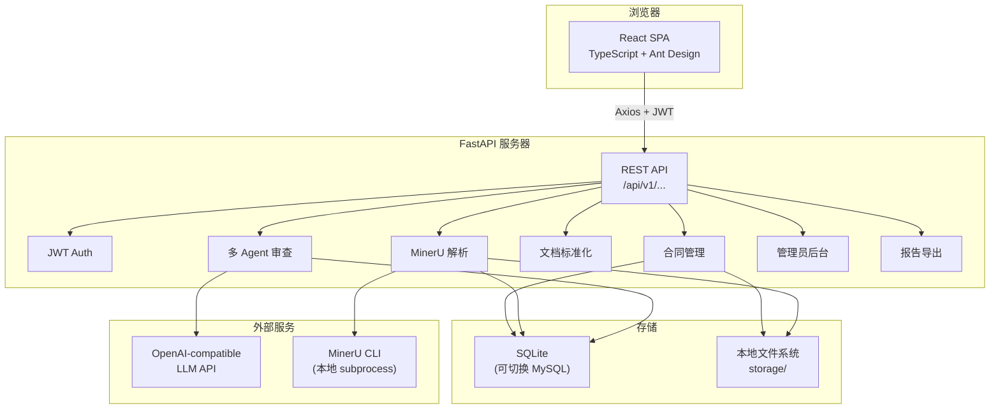
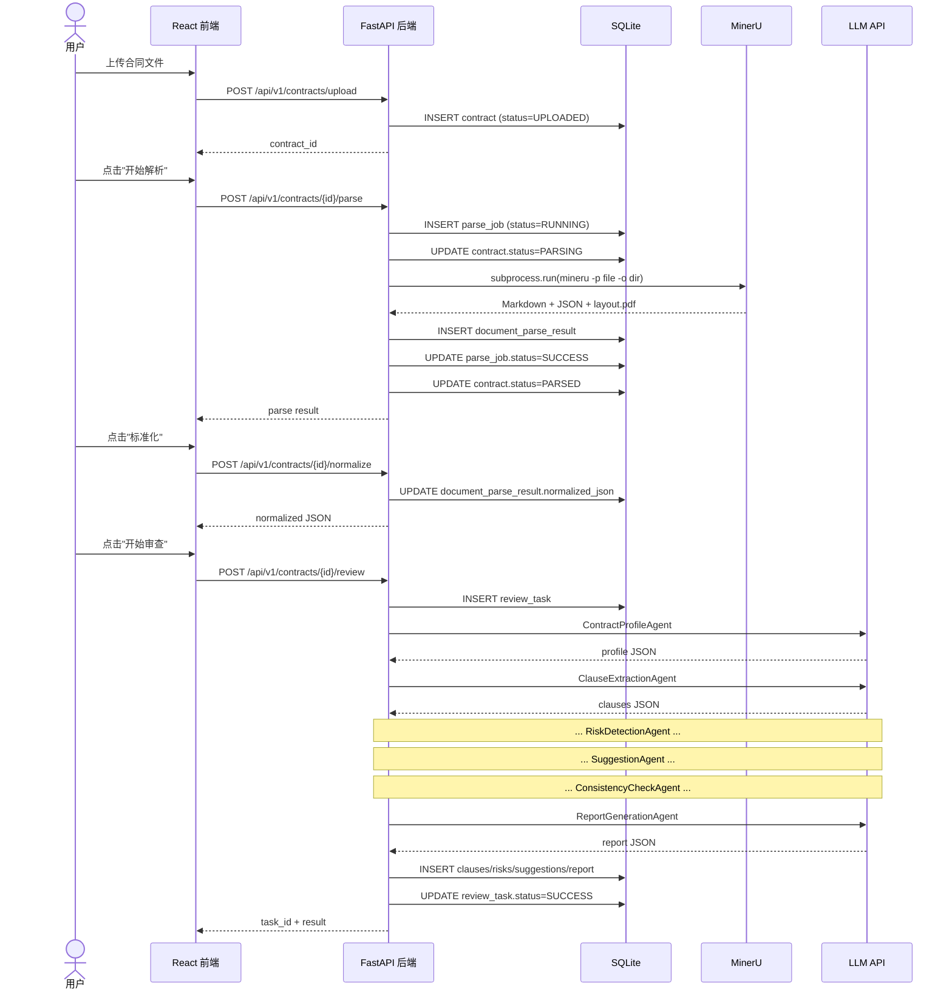
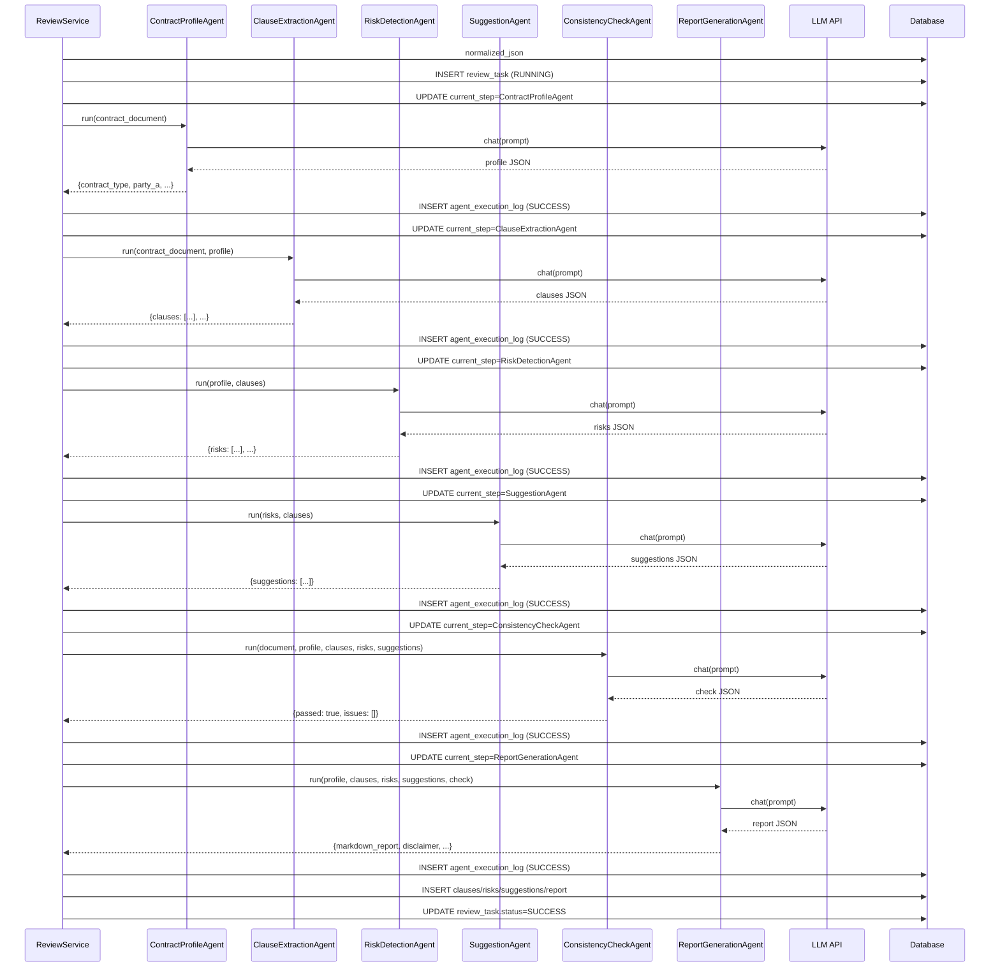
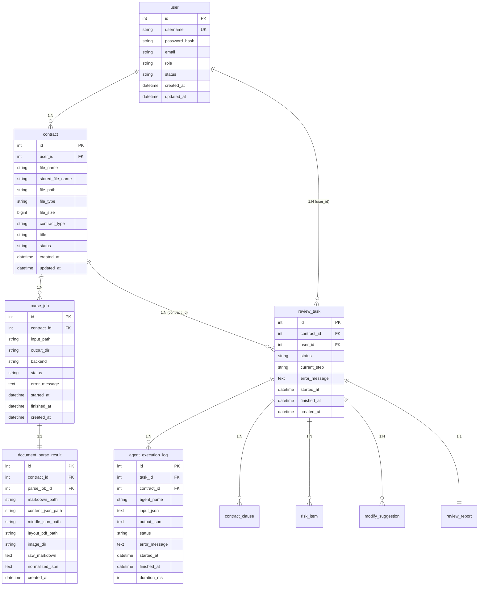
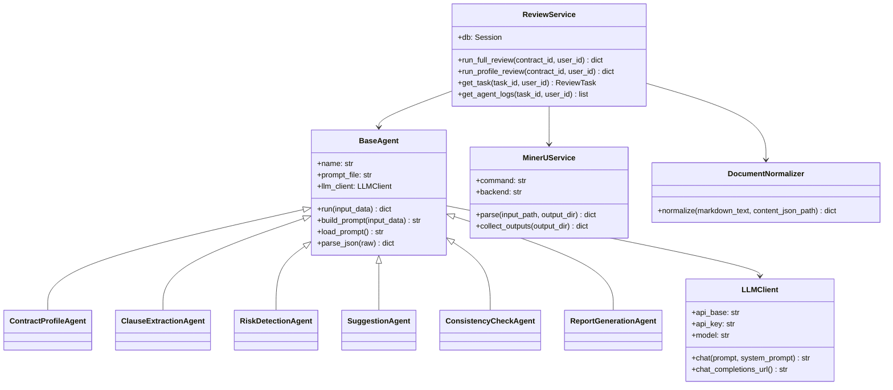

# ClauseMind UML Diagrams

## 1. 系统部署/组件图

```mermaid
graph TB
    subgraph Browser["浏览器"]
        React["React SPA<br/>TypeScript + Ant Design"]
    end

    subgraph Backend["FastAPI 服务器"]
        API["REST API<br/>/api/v1/..."]
        Auth["JWT Auth"]
        Contracts["合同管理"]
        Parse["MinerU 解析"]
        Normalize["文档标准化"]
        Review["多 Agent 审查"]
        Admin["管理员后台"]
        Export["报告导出"]
    end

    subgraph Storage["存储"]
        SQLite["SQLite<br/>(可切换 MySQL)"]
        FS["本地文件系统<br/>storage/"]
    end

    subgraph External["外部服务"]
        LLM["OpenAI-compatible<br/>LLM API"]
        MinerU["MinerU CLI<br/>(本地 subprocess)"]
    end

    React -->|Axios + JWT| API
    API --> Auth
    API --> Contracts
    API --> Parse
    API --> Normalize
    API --> Review
    API --> Admin
    API --> Export
    Contracts --> SQLite
    Contracts --> FS
    Parse --> MinerU
    Parse --> FS
    Parse --> SQLite
    Review --> LLM
    Review --> SQLite
```

## 2. 用户上传-解析-审查时序图

```mermaid
sequenceDiagram
    actor U as 用户
    participant FE as React 前端
    participant BE as FastAPI 后端
    participant DB as SQLite
    participant MU as MinerU
    participant LLM as LLM API

    U->>FE: 上传合同文件
    FE->>BE: POST /api/v1/contracts/upload
    BE->>DB: INSERT contract (status=UPLOADED)
    BE-->>FE: contract_id

    U->>FE: 点击"开始解析"
    FE->>BE: POST /api/v1/contracts/{id}/parse
    BE->>DB: INSERT parse_job (status=RUNNING)
    BE->>DB: UPDATE contract.status=PARSING
    BE->>MU: subprocess.run(mineru -p file -o dir)
    MU-->>BE: Markdown + JSON + layout.pdf
    BE->>DB: INSERT document_parse_result
    BE->>DB: UPDATE parse_job.status=SUCCESS
    BE->>DB: UPDATE contract.status=PARSED
    BE-->>FE: parse result

    U->>FE: 点击"标准化"
    FE->>BE: POST /api/v1/contracts/{id}/normalize
    BE->>DB: UPDATE document_parse_result.normalized_json
    BE-->>FE: normalized JSON

    U->>FE: 点击"开始审查"
    FE->>BE: POST /api/v1/contracts/{id}/review
    BE->>DB: INSERT review_task
    BE->>LLM: ContractProfileAgent
    LLM-->>BE: profile JSON
    BE->>LLM: ClauseExtractionAgent
    LLM-->>BE: clauses JSON
    Note over BE,LLM: ... RiskDetectionAgent ...
    Note over BE,LLM: ... SuggestionAgent ...
    Note over BE,LLM: ... ConsistencyCheckAgent ...
    BE->>LLM: ReportGenerationAgent
    LLM-->>BE: report JSON
    BE->>DB: INSERT clauses/risks/suggestions/report
    BE->>DB: UPDATE review_task.status=SUCCESS
    BE-->>FE: task_id + result
```

## 3. 多 Agent 工作流时序图

```mermaid
sequenceDiagram
    participant RS as ReviewService
    participant CP as ContractProfileAgent
    participant CE as ClauseExtractionAgent
    participant RD as RiskDetectionAgent
    participant SG as SuggestionAgent
    participant CC as ConsistencyCheckAgent
    participant RG as ReportGenerationAgent
    participant LLM as LLM API
    participant DB as Database

    RS->>DB: normalized_json
    RS->>DB: INSERT review_task (RUNNING)
    RS->>DB: UPDATE current_step=ContractProfileAgent

    RS->>CP: run(contract_document)
    CP->>LLM: chat(prompt)
    LLM-->>CP: profile JSON
    CP-->>RS: {contract_type, party_a, ...}
    RS->>DB: INSERT agent_execution_log (SUCCESS)

    RS->>DB: UPDATE current_step=ClauseExtractionAgent
    RS->>CE: run(contract_document, profile)
    CE->>LLM: chat(prompt)
    LLM-->>CE: clauses JSON
    CE-->>RS: {clauses: [...], ...}
    RS->>DB: INSERT agent_execution_log (SUCCESS)

    RS->>DB: UPDATE current_step=RiskDetectionAgent
    RS->>RD: run(profile, clauses)
    RD->>LLM: chat(prompt)
    LLM-->>RD: risks JSON
    RD-->>RS: {risks: [...], ...}
    RS->>DB: INSERT agent_execution_log (SUCCESS)

    RS->>DB: UPDATE current_step=SuggestionAgent
    RS->>SG: run(risks, clauses)
    SG->>LLM: chat(prompt)
    LLM-->>SG: suggestions JSON
    SG-->>RS: {suggestions: [...]}
    RS->>DB: INSERT agent_execution_log (SUCCESS)

    RS->>DB: UPDATE current_step=ConsistencyCheckAgent
    RS->>CC: run(document, profile, clauses, risks, suggestions)
    CC->>LLM: chat(prompt)
    LLM-->>CC: check JSON
    CC-->>RS: {passed: true, issues: []}
    RS->>DB: INSERT agent_execution_log (SUCCESS)

    RS->>DB: UPDATE current_step=ReportGenerationAgent
    RS->>RG: run(profile, clauses, risks, suggestions, check)
    RG->>LLM: chat(prompt)
    LLM-->>RG: report JSON
    RG-->>RS: {markdown_report, disclaimer, ...}
    RS->>DB: INSERT agent_execution_log (SUCCESS)

    RS->>DB: INSERT clauses/risks/suggestions/report
    RS->>DB: UPDATE review_task.status=SUCCESS
```

## 4. ER 图

```mermaid
erDiagram
    user ||--o{ contract : "1:N"
    user ||--o{ review_task : "1:N (user_id)"
    contract ||--o{ parse_job : "1:N"
    contract ||--o{ review_task : "1:N (contract_id)"
    parse_job ||--|| document_parse_result : "1:1"
    review_task ||--o{ agent_execution_log : "1:N"
    review_task ||--o{ contract_clause : "1:N"
    review_task ||--o{ risk_item : "1:N"
    review_task ||--o{ modify_suggestion : "1:N"
    review_task ||--|| review_report : "1:1"

    user {
        int id PK
        string username UK
        string password_hash
        string email
        string role
        string status
        datetime created_at
        datetime updated_at
    }

    contract {
        int id PK
        int user_id FK
        string file_name
        string stored_file_name
        string file_path
        string file_type
        bigint file_size
        string contract_type
        string title
        string status
        datetime created_at
        datetime updated_at
    }

    parse_job {
        int id PK
        int contract_id FK
        string input_path
        string output_dir
        string backend
        string status
        text error_message
        datetime started_at
        datetime finished_at
        datetime created_at
    }

    document_parse_result {
        int id PK
        int contract_id FK
        int parse_job_id FK
        string markdown_path
        string content_json_path
        string middle_json_path
        string layout_pdf_path
        string image_dir
        text raw_markdown
        text normalized_json
        datetime created_at
    }

    review_task {
        int id PK
        int contract_id FK
        int user_id FK
        string status
        string current_step
        text error_message
        datetime started_at
        datetime finished_at
        datetime created_at
    }

    agent_execution_log {
        int id PK
        int task_id FK
        int contract_id FK
        string agent_name
        text input_json
        text output_json
        string status
        text error_message
        datetime started_at
        datetime finished_at
        int duration_ms
    }
```

## 5. 核心类图

```mermaid
classDiagram
    class BaseAgent {
        +name: str
        +prompt_file: str
        +llm_client: LLMClient
        +run(input_data) dict
        +build_prompt(input_data) str
        +load_prompt() str
        +parse_json(raw) dict
    }

    class LLMClient {
        +api_base: str
        +api_key: str
        +model: str
        +chat(prompt, system_prompt) str
        +chat_completions_url() str
    }

    class ReviewService {
        +db: Session
        +run_full_review(contract_id, user_id) dict
        +run_profile_review(contract_id, user_id) dict
        +get_task(task_id, user_id) ReviewTask
        +get_agent_logs(task_id, user_id) list
    }

    class MinerUService {
        +command: str
        +backend: str
        +parse(input_path, output_dir) dict
        +collect_outputs(output_dir) dict
    }

    class DocumentNormalizer {
        +normalize(markdown_text, content_json_path) dict
    }

    BaseAgent <|-- ContractProfileAgent
    BaseAgent <|-- ClauseExtractionAgent
    BaseAgent <|-- RiskDetectionAgent
    BaseAgent <|-- SuggestionAgent
    BaseAgent <|-- ConsistencyCheckAgent
    BaseAgent <|-- ReportGenerationAgent
    BaseAgent --> LLMClient
    ReviewService --> BaseAgent
    ReviewService --> MinerUService
    ReviewService --> DocumentNormalizer
```
